# Random variables 

A **random variable** $Z$ is a function over a sample space $\Omega$ to the space of outputs $H$.

$$
Z:\Omega\to H\\
\hspace{1.3cm}\omega \mapsto Z(\omega)
$$

The random variables are described using probabilities.

## A. Discrete variables 

## I. Probability mass function

To indtroduce the probability mass function, we will give some examples: 

### 1) Head or tail

We launch a coin. The result (still unknown) will be equal to

$$Z(\omega) = \left\{\begin{array}{cc}0 &\textrm{ if head}\\
                                 1 &\textrm{ if tail}\\
                                 \end{array}\right.$$

Here $H=\{0,1\}$.

Since we don't know $\omega$, we describe $Z$ using probabilities.

In case of binary variables, we just have to specify the probability that $Z=1$, which is denoted $P(Z=1)$.

More formally, $P$ is a **measure** over $\Omega$, it measures the size of the set $$Z^{-1}(\{1\})=\{\omega\in\Omega,Z(\omega)=1\}.$$

By definition:

$$P(Z=1) = P(Z^{-1}(\{1\})).$$

If $p=P(Z=1)$, then $P(Z=0) = 1-p$.

When $H$ only contains 2 values (0 or 1), the variable is binary and its distribution is named Bernouilli with parameter $p=P(Z=1)$.

### 2) Outputs of a dice

$H=\{1,2,3,4,5,6\}$

The variable is characterized by the definition of $p_i=P(Z=i)$ for $i=1,\dots,6$.

We have $p_1+p_2+p_3+p_4+p_5+p_6=1$.

### 3) General case of discrete variable

$Z$ is a random variable with values in a countable space $H$. 

$Z$ is characterized by its probability mass function, $p(i)=p_i=P(Z=i)$ for all $i\in H$.

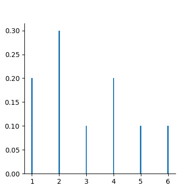

### 4) Uniform distribution over a finite output space $H = \{a_1,\dots,a_n\}$

For all $i=1,\dots,n$, $$p_i=\frac{1}{n}$$

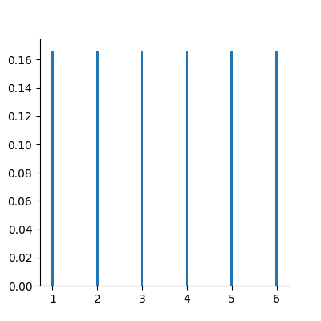

### 5) Binomial distribution of parameters $(n,p)$

It models the sum of $n$ independent Bernouilli variables with parameters $p$.

$H = \{0,1,\dots,n\}$

$$p_i = \frac{n!}{i!(n-i)!}p^i(1-p)^{n-i}$$

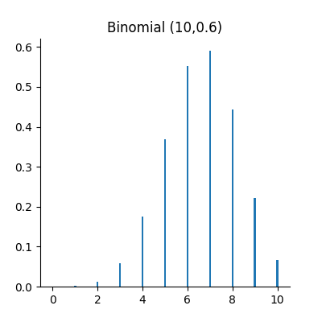

## II. Cumulative distribution 

Instead of working with the probability mass function, we can use the cumulative distribution function $F$ defined by $$F(i) = P(Z\leq i)$$

We can deduce $F$ from the probability mass function $p$  $$F(i) = \sum_{j=1}^i P(Z=j) = \sum_{j=1}^i p(j)$$

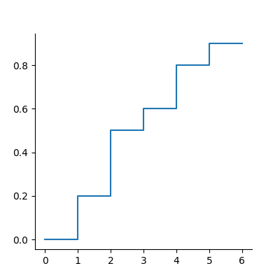

And we can also deduce $p$ from $F$: $$p(i) = P(Z=i) = P(Z\leq i) - P(Z\leq i-1) = F(i)-F(i-1)$$

## III. Property:

$$P(a<Z \leq b) = F(b)-F(a)$$

## IV. Expectation:

The expectation of a random variable with probability mass function $p$ is given by 

$$E[Z]=\sum_{i\in H}i \times P(Z=i)=\sum_{i\in H}i \times p_i$$

The expectation can be seen as the theoretical mean.

**Example:** 

If $Z$ is a Bernouilli variable with parameter $p$, $$E[Z]= 0 \times (1-p) + 1 \times p = p$$

**Expectation of a function** $$E(q(Z))=\sum_{i\in H} q(i) \times P(Z=i)$$

## V. Variance

$$\textrm{Var(Z)} = E[(Z-E[Z])^2]$$

## VI. Random vectors

If $Z_1$ is a random variable on a countable space $H_1$ and $Z_2$ is another random variable on a countable space $H_2$, if we want to fully describe the pair $(Z_1,Z_2)$, we must define the probabilities of all events $\{Z_1=i, Z_2=j\}$ for all $i\in H_1$ and all $j\in H_2$. We will note $$p_{ij}=P(Z_1=i,Z_2=j).$$

Marginalisation

$$p_{i.} = P(Z_1=i) = \sum_{j\in H_2} p_{ij}$$

$$p_{.j}= P(Z_2=j) = \sum_{i\in H_1} p_{ij}$$

**Example:**

The probability $Z_1$ to be a rich man is a Bernouilli variable.

The probability $Z_2$ to be a Geostatistician is a Bernouilli variable.

$$\begin{array}{c|c|c||c} 
 & 0 & 1 \\
 \hline
 0 & p_{00} & p_{01} & p_{0.}\\
 \hline
 1 & p_{10} & p_{11} & p_{1.}\\
 \hline
  & p_{.0} & p_{.1} & 1\\
  \end{array}$$
  
  Conditional distribution

$$P(Z_1=i|Z_2=j) = \frac{P(Z_1=i,Z_2=j)}{P(Z_2=j)} = \frac{p_{ij}}{\sum_{i\in H_1} p_{ij}}$$

## B. Continuous random variable

The output space $H$ is continuous e.g  $\mathbb{R}$ or an interval $[a,b]$.

To characterize the distribution, one can use the cumulative distribution function (c.d.f) defined as $$F(z)=P(Z\leq z).$$

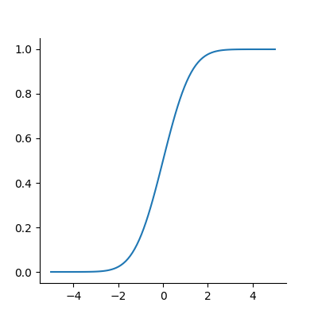

When $F$ is differentiable, $Z$ has a probability density function (p.d.f) $f$ defined as $$f(z)=F'(z).$$ where $$\int_H f(t)dt =1$$

Then, $$F(z) = \int_{-\infty}^z f(t)dt$$

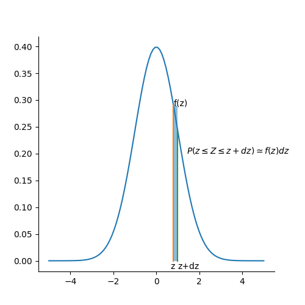

All the variables considered in this course will have a density.

### Examples

1) Gaussian distribution:

The Gaussian distribution with mean $m$ and variance $\sigma^2$ has density 

$$f(x)=\frac{1}{\sqrt{2\pi}\sigma}\displaystyle e^{-\frac{(x-m)^2}{2\sigma^2}}$$

(see curves above)

2) Uniform variable over an interval $[a,b]$

$$f(x) = \left\{\begin{array}{ccc}\frac{1}{b-a} & \textrm{ if } & a<x\leq b\\
0 & \textrm{ otherwise} & \end{array}\right.$$

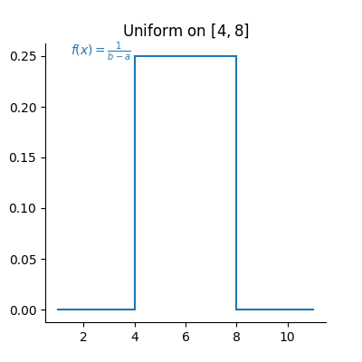

$$F(x) = \left\{\begin{array}{ccc}0 & \textrm{ if } & x\geq a \\
\frac{x-a}{b-a} & \textrm{ if } & a<x\leq b\\
1 & \textrm{ if } & x\geq b\end{array}\right.$$

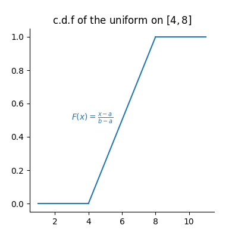

### Expectation 

The expectation plays the role of the mean for the random variable.

It is an average of the values weighted by the density:

$$E[Z] = \int_H tf(t)dt$$

Expectation of a function:

$$E[q(Z)] = \int_H q(t)f(t)dt$$

### Variance 

$$\textrm{Var}[Z] = E[(Z-E[Z])^2]$$

Note that if a random variable $Z$ is positive ($P(Z\geq 0)=1$), then $$E[Z]\geq 0$$

So, the variance is always positive (as the expectation of a positive random variable).

More properties on expectation and variance can be found [here](./covariance.ipynb).

## Law of large numbers

The expectation of a random variable can be seen as the empirical average over an infinite number of realizations of this variable as stated by the (strong) law of large numbers:

Let $Z$ a random variable over $H=\mathbb{R}$ with $E[Z]=m$.
If $Z_1,\dots,Z_n,\dots$ is an infinite sequence of independent copies of $Z$, then the sample average variables $$\bar{Z}_n = \frac{Z_1+\dots,Z_n}{n}$$ converges to $m$ when $n\to\infty$.

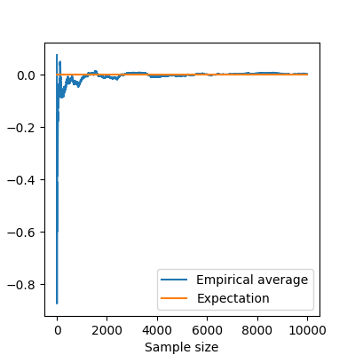

Let's consider the new (Bernouilli) variable $$1\!\!\!1_{a<Z \leq b}=\left\{\begin{array}{ccc}1 & \textrm{ if } & a<Z\leq b\\
0 & \textrm{ otherwise} & \end{array}\right.$$

$$E[1\!\!\!1_{a<Z\leq b}] = P(a<Z\leq b)=\int_a^b f(t)dt$$

So, if we subdivide $H$ into small intervals, we expect that the histogram of a large sample of (independent) realizations of $Z$ is close to its density $f$.

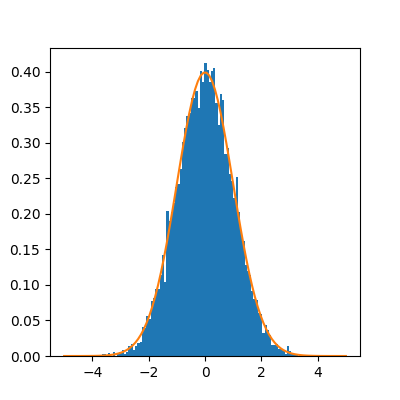

## Bivariate distribution

If we have two random variables $X$ and $Y$, we can describe them independently but we can also be interested by their link. We can do that by using a joint distribution.
Here we will suppose that the random vector $(X,Y)$ has a density $f(x,y)$.

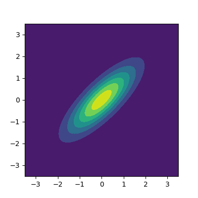

The density can be seen as the probability 

$$P(x\leq X \leq x+dx \textrm{ and } y\leq Y\leq y+dy) =f(x,y)dxdy$$

We have seen that the density of a single variable plays the role of the histogram computed over an infinite number of realizations.

Let's observe a large number of realizations from the previous bivariate distribution.

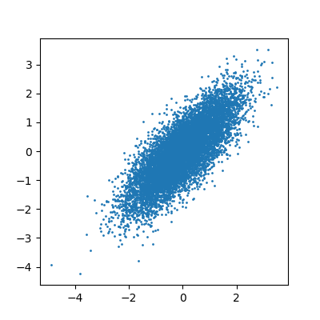

Let's compute the 2d histogram and compare with the theoretical distribution:

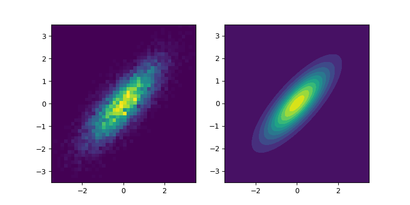

### Marginalisation

We can retrieve the marginal distribution of each variable from the bivariate density:

$$f_X(x)=\int_{H_2}f(x,y)dy$$

$$f_Y(y)=\int_{H_1}f(x,y)dx$$

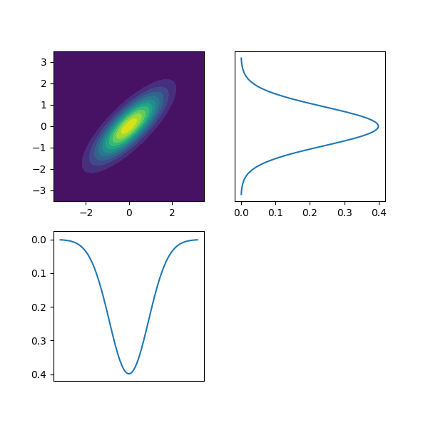

###  Conditional distributions

We have two variables $X$ and $Y$ with joint density $f(x,y)$. Suppose we have observed $X=x$ and we would like to know the distribution of $Y$ knowing this information.

It can be computed by 

$$f_{Y|X=x}(y)=\frac{f(x,y)}{f(x)}$$

It can be interpreted as 

$$P(y\leq Y\leq y+dy| x\leq X \leq x+dx) = f_{Y|X=x}(y)dy$$

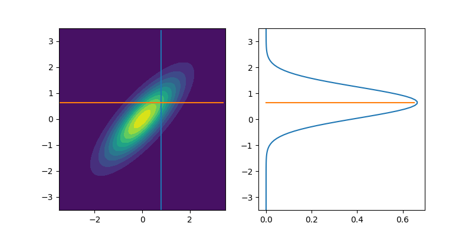

The conditional expectation $$E[Y|X=x]=\int_{H_2}yf_{Y|X=x}(y)dy$$

is the expectation of $Y$ with the conditional distribution.

It is the best possible prediction of $Y$ knowing $X$, i.e, it is the function of $X$ which minimizes $$\textrm{Var}(Y-q(X))$$ amongst all the possible functions.

To summarize bivariate distributions, one can use the covariance.
See [here](./covariance.ipynb).

### Multivariate distributions

We can generalize to a set $X_1,\dots,X_p$ of variables by using multivariate densities
$$f(x_1,\dots,x_p)$$

In geostatistics, we often use the multivariate gaussian distribution.
